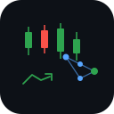

<p align="center">
  
</p>

<h1 align="center">Trade Agent</h1>

<p align="center">
  Modular AI trading agent with plugin system.<br>
  LLM analyzes market + news + indicators → decision → execution.<br>
  Every component swappable. No framework. No lock-in.
</p>

<p align="center">
  
  
  
  <a href="TESTS.md"></a>
  
  
  
</p>

<p align="center">
  
  
  
  
  
  
</p>

<p align="center">
  
  
  
  
  
  
</p>

---

<p align="center">
  <a href="#quick-start"></a>
  <a href="#features"></a>
  <a href="#plugin-system"></a>
  <a href="#advanced-features"></a>
  <a href="#risk-profiles"></a>
  <a href="TESTS.md"></a>
  <a href="#deploy"></a>
</p>

<details>
<summary>🇮🇩 Bahasa Indonesia</summary>

## Apa ini?

Bot trading AI modular dengan sistem plugin. LLM analisa data market + news + indikator teknikal → decision → eksekusi trade.

Setiap komponen bisa diganti via plugin. Nggak ada framework, nggak ada lock-in.

## Quick Start

```bash
git clone https://github.com/mocasus/trade-agent.git
cd trade-agent
pip install -e ".[all]"
cp config.example.yaml config.yaml

echo "AI_API_KEY=sk-xxx" >> .env
echo "BINANCE_API_KEY=xxx" >> .env
echo "BINANCE_API_SECRET=xxx" >> .env

python -m trade_agent --config config.yaml  # Paper mode default
```

## Plugin System

6 slot yang bisa diganti:
- **data_source**: ccxt | csv
- **strategy**: llm | rule | partial_exit | rule_builder
- **exchange**: ccxt | paper | bybit_futures
- **notifier**: telegram | discord | webhook | console
- **sentiment**: rss_llm | none
- **risk_profile**: conservative | moderate | aggressive | trailing_stop | kelly_sizing

## Safety

- Paper mode ON default
- Paper mode forced 24h pertama
- Kill switch: Telegram `/stop`
- Daily loss limit hard stop
- Audit trail: semua decision di-log

</details>

---

## ✨ Features

- 🧩 **Plugin system** — 7 swappable slots, 21 built-in plugins
- 🤖 **LLM strategy** — OpenAI-compatible API analyzes market context → structured decision
- 📊 **Technical indicators** — RSI, MACD, EMA, Bollinger Bands, ATR
- 🔄 **Trailing stop-loss** — follows price up, never goes down
- 📐 **Kelly criterion** — optimal fractional position sizing
- 🎯 **Partial exits** — scaled exits at profit levels (25%/25%/50%)
- 📋 **Rule builder** — config-only strategy, no code needed
- 📰 **News sentiment** — RSS + LLM sentiment analysis
- 🔔 **Multi-notifier** — Telegram, Discord, webhook, console
- 📈 **Backtest engine** — historical replay + Sharpe/drawdown/win rate
- 🖥️ **Web dashboard** — dark theme, real-time portfolio monitoring
- 🐳 **Docker compose** — multi-instance deployment
- 🛡️ **Safety-first** — paper mode default, kill switch, daily loss limit, audit trail

## Quick Start

```bash
git clone https://github.com/mocasus/trade-agent.git
cd trade-agent
pip install -e ".[all]"
cp config.example.yaml config.yaml  # Edit before running

echo "AI_API_KEY=sk-xxx" >> .env
echo "BINANCE_API_KEY=xxx" >> .env

python -m trade_agent --config config.yaml  # Paper mode by default
```

## Architecture

```
┌──────────┐ ┌──────────┐ ┌──────────┐ ┌──────────┐ ┌──────────┐
│DataSource│ │ Strategy │ │ Exchange │ │ Notifier │ │Sentiment │
│ ccxt/csv │ │llm/rule  │ │paper/real│ │ TG/Disc  │ │ rss_llm  │
└──────────┘ └──────────┘ └──────────┘ └──────────┘ └──────────┘
      │            │            │
      ▼            ▼            ▼
┌─────────┐  ┌──────────┐  ┌─────────┐
│Data Layer│─▶│ Strategy │─▶│Execution│
└─────────┘  └──────────┘  └─────────┘
                                 │
              ┌─────────┐       ▼
              │ Storage │  ┌─────────┐
              │ SQLite  │  │Notifier │
              └─────────┘  └─────────┘
```

Core loop only knows interfaces. Swap any plugin without touching core.

## Plugin System

| Slot | Interface | Built-in Plugins |
|------|-----------|-----------------|
| data_source | `DataSourceInterface` | ccxt, csv |
| strategy | `StrategyInterface` | llm, rule, partial_exit, rule_builder |
| exchange | `ExchangeInterface` | ccxt, paper, bybit_futures |
| notifier | `NotifierInterface` | telegram, discord, webhook, console |
| sentiment | `SentimentInterface` | rss_llm, none |
| risk_profile | `RiskProfileInterface` | conservative, moderate, aggressive, trailing_stop, kelly_sizing |
| indicators | `IndicatorPluginInterface` | ta (RSI, MACD, EMA, BB, ATR) |

**Custom plugin** — implement interface → place in `~/.trade-agent/plugins/<slot>/`

```python
# ~/.trade-agent/plugins/strategy/my_quant.py
from trade_agent.interfaces import StrategyInterface
from trade_agent.models import Decision, MarketContext, Action

class MyQuantStrategy(StrategyInterface):
    def analyze(self, context: MarketContext) -> Decision:
        return Decision(action=Action.BUY, symbol=context.symbol,
                        confidence=80, reasoning="...")

def register():
    return {"name": "my_quant", "class": MyQuantStrategy}
```

Config: `plugins.strategy: "my_quant"`

## Advanced Features

### Trailing Stop-Loss

```yaml
risk:
  method: trailing_stop
  trailing_stop:
    activation_threshold: 0.03  # Activate after 3% profit
    trail_percent: 0.015        # Trail 1.5% below peak
```

### Kelly Criterion Sizing

```yaml
risk:
  position_sizing:
    method: kelly
    kelly_fraction: 0.5  # Half-Kelly (recommended)
```

### Bybit Futures

```yaml
plugins:
  exchange: bybit_futures
exchange:
  bybit_futures:
    leverage: 3
    margin_mode: cross
```

### Partial Exit

```yaml
strategy:
  partial_exit:
    levels:
      - profit_pct: 5,  exit_pct: 25
      - profit_pct: 10, exit_pct: 25
      - profit_pct: 15, exit_pct: 50
```

### Rule Builder

```yaml
strategy:
  rule_builder:
    rules:
      - name: "RSI oversold buy"
        conditions: [{indicator: rsi, operator: "<", value: 30}]
        action: buy, confidence: 75
      - name: "MACD sell"
        conditions: [{indicator: macd_histogram, operator: "<", value: 0}]
        action: sell, confidence: 70
```

### Web Dashboard

```bash
python -m trade_agent.dashboard --config config.yaml  # :8080
```

## Risk Profiles

| | Conservative | Moderate | Aggressive | Trailing Stop | Kelly |
|---|---|---|---|---|---|
| Max position | 2% | 8% | 15% | 10% | Dynamic |
| Confidence floor | 70 | 65 | 55 | 60 | 60 |
| Stop-loss | ATR×1.0 | ATR×1.5 | ATR×2.0 | Trail 1.5% | ATR×1.5 |
| R:R ratio | 1.5 | 2.0 | 1.5 | Variable | 2.0 |
| Daily loss limit | 2% | 5% | 10% | 5% | 5% |

## 🛡️ Safety

- **Paper mode ON by default** — won't trade real money
- **Paper mode forced 24h** — can't accidentally go live
- **Kill switch** — Telegram `/stop` halts immediately
- **Daily loss limit** — hard stop, AI can't override
- **Max position size** — AI can't exceed configured %
- **Audit trail** — every decision logged with reasoning
- **Auto-stop on error** — halts on unhandled exceptions
- **Max API failures** — stops after N consecutive failures

## Backtesting

```bash
python -m trade_agent.backtest --config config.yaml
```

Outputs: total return, win rate, Sharpe ratio, max drawdown.

📋 **[Full test results →](TESTS.md)** — 39 tests, 7 suites, all passing.

## Deploy

### systemd

```bash
sudo cp trade-agent.service /etc/systemd/system/
sudo systemctl enable --now trade-agent
```

### Docker

```bash
docker-compose up -d
```

## Project Structure

```
trade_agent/
├── agent.py              # Main loop
├── interfaces.py         # 6 abstract interfaces
├── plugin_loader.py      # Plugin discovery + loading
├── config.py             # YAML config + env var resolution
├── models.py             # Data models
├── storage.py            # SQLite persistence
├── risk.py               # Built-in risk profiles
├── backtest.py           # Historical replay engine
├── dashboard/            # Web dashboard
│   ├── server.py
│   └── templates/
└── plugins/              # Built-in plugins
    ├── data_source/      # ccxt, csv
    ├── strategy/         # llm, rule, partial_exit, rule_builder
    ├── exchange/         # ccxt, paper, bybit_futures
    ├── notifier/         # telegram, discord, webhook, console
    ├── sentiment/        # rss_llm, none
    ├── risk_profile/     # conservative, moderate, aggressive, trailing_stop, kelly_sizing
    └── indicators/       # ta (RSI, MACD, EMA, BB, ATR)
```

## License

MIT

---

<p align="center">
  <strong>Made with</strong>
</p>

<p align="center">
  
  
  
  
  
</p>

<p align="center">
  <strong>Supported Exchanges</strong>
</p>

<p align="center">
  
  
  
  
  
</p>

<p align="center">
  <strong>Integrations</strong>
</p>

<p align="center">
  
  
  
  
</p>

<p align="center">
  <strong>Status</strong>
</p>

<p align="center">
  
  
  
  
  
</p>

---

<p align="center">
  <sub>v1.0.0 · 2026 · Built by <a href="https://github.com/mocasus">@mocasus</a></sub>
</p>